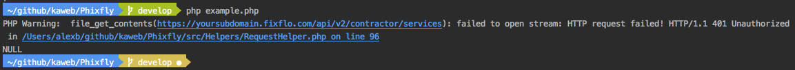

# What does "Phixfly" mean?

It's a gathering of the description: A pretty fly PHP Client for the [Fixflo API](https://api-docs.fixflo.com).

## Prerequisites

The following is a list of prerequisites for Phixfly

```
PHP Version >= 5.6.0
```

### Installing

To install this library locally we recommend using [Composer](https://getcomposer.org/).

You can use `composer require kaweb/phixfly` to get the latest released version of the project. 

The above command will pull [this version](https://github.com/kaweb/Phixfly/releases/latest) of the project locally.

To test that this has worked locally you should run
```
cd ~/path/to/project
```

Followed by

```
php example.php
```

If you get the following output



Then it's correctly installed!

## Built using

* [PHP](http://www.dropwizard.io/1.0.2/docs/) - The primary programming language
* [Composer](https://getcomposer.org/) - Dependency Management

## Contributing

It is worth noting that all contributions must comply with the [PSR-2 standards](https://github.com/php-fig/fig-standards/blob/master/accepted/PSR-2-coding-style-guide.md)

## Versioning

We use [SemVer](http://semver.org/) for versioning. For the versions available, see the [tags on this repository](https://github.com/kaweb/phixfly/tags). 

## Authors

* **Alex Blackham** - *Developer and Maintainer* - [B3none](https://github.com/b3none)
* **Alex Phair** - *Project graphic* - [AlexPhair](https://github.com/AlexPhair)

See also the list of [contributors](https://github.com/kaweb/phixfly/contributors) who participated in this project.

## License

This project is licensed under the MIT License - see the [LICENSE.md](LICENSE.md) file for details